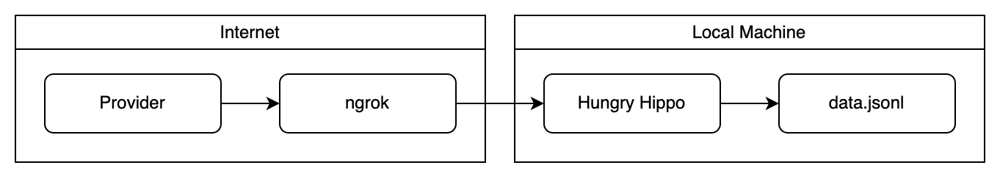

# Hungry Hippo

Hungry Hippo is a [Deno](https://deno.com/) HTTP server that accepts JSON
payloads via POST, PUT and PATCH requests and appends the received JSON to a
[JSON Lines](https://jsonlines.org/) file. [ngrok](https://ngrok.com/) is used
to expose the server to the internet. Hungry Hippo was created to be used with
the
[RudderStack webhooks destination](https://www.rudderstack.com/docs/destinations/webhooks/),
but can be used to consume webhooks from other providers.



## Prerequisite

Install Deno. [Homebrew](https://brew.sh/) is recommended for macOS:

```bash
brew install deno
```

## Usage

1. Run HTTP server and tunnel:

```bash
deno run -A https://raw.githubusercontent.com/esadek/hungry-hippo/main/main.ts
```

2. Send requests to ngrok URL:

```bash
curl --json '{"event": "test"}' https://abc-123.ngrok-free.app
```

3. View JSON objects in `data.jsonl`:

```bash
cat data.jsonl
```
